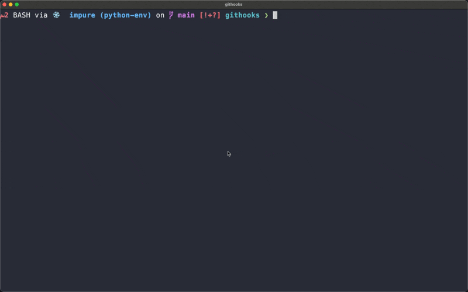

# Linting Tools and GitHooks

## What is this project?

We are experimenting with [gptscript](https://github.com/gptscript-ai/gptscript) to create instructions like the following.

> Find useful linters for my project and then setup githooks

Each linting tool comes with it's own "AI sidecar"
to help developers quickly integrate and get the most of each tool.
We are also solving the problem of tool installation by using the local
docker engine to run all linting processes.  The only pre-requisite is
Docker Desktop.

For example, using the gpt script tools defined [here](tool.gpt), we can setup linters in the current project.



After analyzing the project for different file types and setting up the githooks, both the `pre-commit` and
`commit-msg` hooks will integrate tools.


## How to get started

Until we integrate this with a local chat agent, the easiest way to get started is with a simple
gptscript.

```
tools: github.com/docker/githooks

Install githooks in my project
```

As long as you have a local docker engine running, any linting tools used by your
project will automatically download the first time the hooks run.
