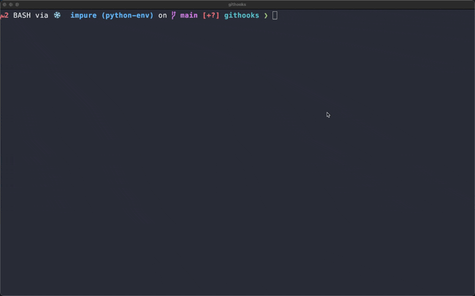

# Containerizing GitHooks

## What is this project

The prompts in this repository use Generative AI to create an AI sidecar for configuing and
using githooks.  Some of the goals of this project are summarized in [this post](https://www.linkedin.com/pulse/docker-labs-genai-2-docker-trtle/).
The basic prompt is.

> How do I setup githooks?

Each linting tool comes with it's own "AI sidecar"
to help developers quickly integrate and get the most of each tool.
We are also solving the problem of tool installation by using the local
docker engine to run all linting processes.  The only pre-requisite is
Docker Desktop.

After analyzing the project for different file types and setting up the githooks,
both the `pre-commit` and
`commit-msg` hooks will be configured by the assistant.

## How to get started

Make sure that your local Docker Desktop engine is running.

